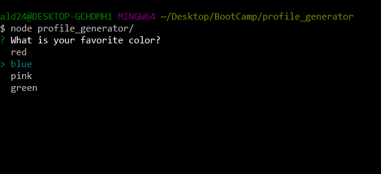
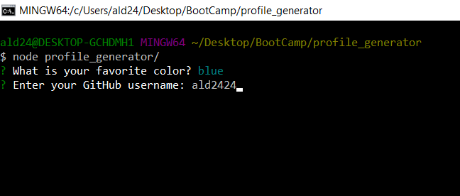
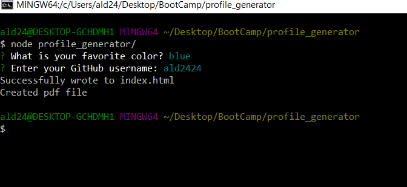

# profile_generator
This application uses Node.js to create a pdf resume as well as a webpage resume based off of the user's favorite color and github profile information.

The terminal firsts asks for the user to choose their favorite color from a list of colors provided.

It then asks the user to enter their GitHub username

The terminal will then notify the user that an index.html has been created as well as a pdf file

Here is an example of the PDF file:

Here is an example of the webpage:

The backgroud color of these files will change based off of the user's preference.

The profile generator works by using axios to pull the user's information from GitHub to create the content found on this resume.
The index.html file is create first. then by using the html-pdf library my program reads the index.html file to create the pdf file.
